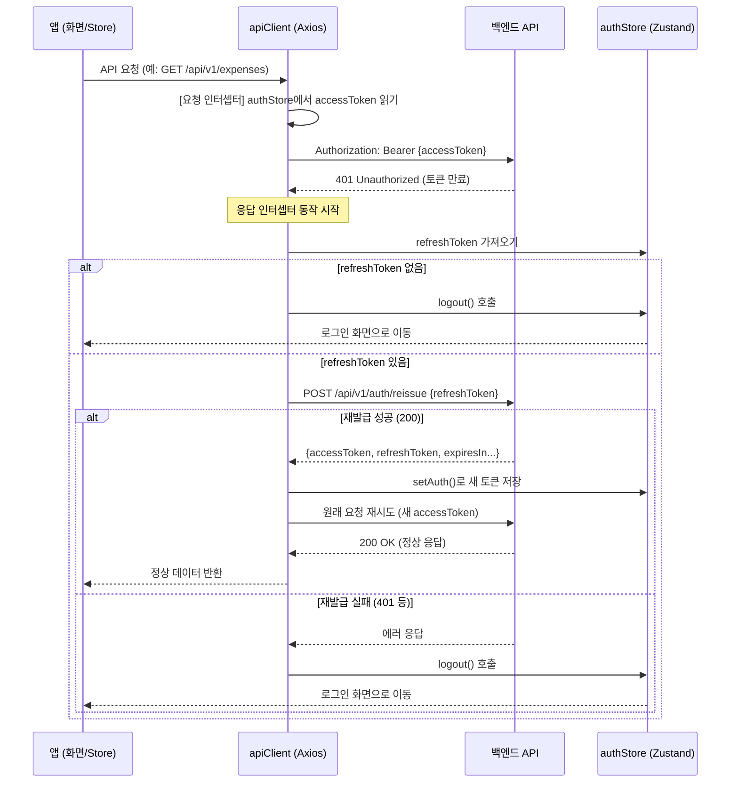
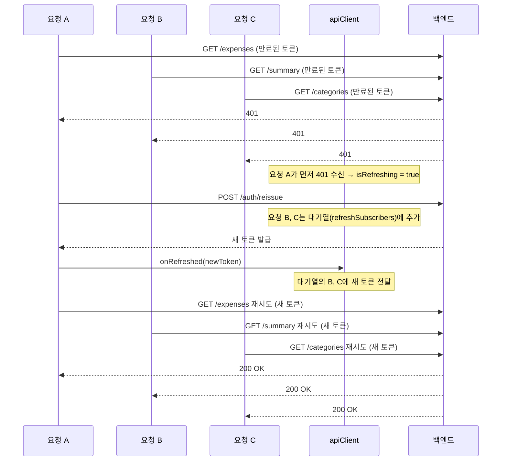

# 웹 빌드 `import.meta` SyntaxError 트러블슈팅

## 1. 발생한 오류

Expo 웹(`expo start --web`)으로 접속 시 브라우저 콘솔에 아래 에러가 출력되며 **화면이 전혀 렌더링되지 않았습니다.**

```
Uncaught SyntaxError: Cannot use 'import.meta' outside a module
  (at entry.bundle?platform=web&dev=true&hot=false&lazy=true
  &transform.engine=hermes&transform.routerRoot=app
  &unstable_transformProfile=hermes-stable:279324:65)
```

- iOS / Android 네이티브 빌드에서는 정상 동작
- **웹 전용 오류**로, Metro 번들러가 생성한 번들 파일 내부에 `import.meta` 구문이 그대로 포함되어 브라우저가 파싱할 수 없는 상태

---

## 2. 원인 분석

### 2-1. `import.meta`는 어디에서 오는가?

프로젝트 소스 코드(`src/`, `app/`)에서는 **`import.meta`를 직접 사용하지 않습니다.** 원인은 **`zustand` v5** 패키지입니다.

```bash
# 검색 결과
node_modules/zustand/esm/middleware.mjs  ← ESM 버전에만 존재
```

해당 파일의 문제 코드:

```javascript
// node_modules/zustand/esm/middleware.mjs (line 62, 124)
extensionConnector =
  (enabled != null
    ? enabled
    : (import.meta.env ? import.meta.env.MODE : void 0) !== "production") &&
  window.__REDUX_DEVTOOLS_EXTENSION__;
```

반면, CJS 버전(`node_modules/zustand/middleware.js`)에는 `import.meta`가 **존재하지 않습니다.**

### 2-2. 왜 ESM 버전이 로드되는가?

`zustand`의 `package.json` exports 설정:

```json
{
  "exports": {
    "./*": {
      "react-native": { "default": "./*.js" },       // ✅ CJS — import.meta 없음
      "import":       { "default": "./esm/*.mjs" },   // ❌ ESM — import.meta 있음
      "default":      { "default": "./*.js" }          // ✅ CJS — import.meta 없음
    }
  }
}
```

Expo의 Metro 설정(`@expo/metro-config`)에서 **플랫폼별 condition** 설정:

```javascript
// node_modules/@expo/metro-config/build/ExpoMetroConfig.js
unstable_conditionsByPlatform: {
  ios:     ['react-native'],   // → zustand의 "react-native" 조건 매칭 → CJS ✅
  android: ['react-native'],   // → zustand의 "react-native" 조건 매칭 → CJS ✅
  web:     ['browser'],        // → zustand에 "browser" 조건 없음 → "import"로 fallback → ESM ❌
}
```

**정리:**

| 플랫폼  | Metro condition | zustand exports 매칭 | 로드되는 파일 | 결과 |
|---------|----------------|---------------------|-------------|------|
| iOS     | `react-native` | `"react-native"`    | `middleware.js` (CJS) | ✅ 정상 |
| Android | `react-native` | `"react-native"`    | `middleware.js` (CJS) | ✅ 정상 |
| Web     | `browser`      | 매칭 없음 → `"import"` fallback | `esm/middleware.mjs` (ESM) | ❌ **에러** |

### 2-3. `babel.config.js` 누락 문제

프로젝트에 `babel.config.js`가 아예 없었습니다. Expo 프로젝트에서는 `babel-preset-expo`를 통해 다양한 문법 변환(JSX, import.meta 등)을 처리하는데, 이 설정이 없으면 변환 파이프라인이 불완전하게 동작합니다.

---

## 3. 해결 방법

### 3-1. `babel.config.js` 생성

표준 Expo Babel 프리셋을 적용합니다.

```javascript
// babel.config.js (신규 생성)
module.exports = function (api) {
  api.cache(true);
  return {
    presets: ['babel-preset-expo'],
  };
};
```

> `babel-preset-expo`는 JSX, TypeScript, 플랫폼별 모듈 변환 등을 포함하는 Expo 공식 프리셋입니다. 이것만으로는 `import.meta` 문제가 완전히 해결되지 않았습니다 — Metro가 zustand ESM 파일 자체를 로드하는 것이 근본 원인이기 때문입니다.

### 3-2. `metro.config.js` — 웹 플랫폼에 `react-native` condition 추가 (핵심 해결)

```javascript
// metro.config.js
const { getDefaultConfig } = require('expo/metro-config');

const config = getDefaultConfig(__dirname);

config.transformer = {
  ...config.transformer,
  babelTransformerPath: require.resolve('react-native-svg-transformer'),
};

config.resolver = {
  ...config.resolver,
  assetExts: config.resolver.assetExts.filter(ext => ext !== 'svg'),
  sourceExts: [...config.resolver.sourceExts, 'svg'],
  // ✅ 핵심 수정: 웹에서 zustand 등 패키지가 ESM(.mjs)의 import.meta를 사용하는 문제 방지
  // react-native 조건을 추가하여 CJS 버전으로 resolve 되도록 함
  unstable_conditionsByPlatform: {
    ...config.resolver.unstable_conditionsByPlatform,
    web: [
      'browser',
      'react-native',
      ...(config.resolver.unstable_conditionsByPlatform?.web ?? []),
    ],
  },
};

module.exports = config;
```

**동작 원리:**

```
[수정 전] Web conditions: ['browser']
  → zustand에 'browser' 없음
  → 'import' fallback
  → esm/middleware.mjs 로드 (import.meta 포함 ❌)

[수정 후] Web conditions: ['browser', 'react-native']
  → zustand에 'browser' 없음
  → 'react-native' 매칭 ✅
  → middleware.js 로드 (CJS, import.meta 없음 ✅)
```

---

## 4. 적용 후 캐시 초기화

Metro 번들러는 이전 resolve 결과를 캐시하므로, 설정 변경 후 반드시 캐시를 초기화해야 합니다.

```bash
# 기존 실행 중인 Metro 프로세스 종료
lsof -ti:8081 | xargs kill -9

# 캐시 초기화 후 재시작
npx expo start --web --clear
```

---

## 5. 결과

| 항목 | 수정 전 | 수정 후 |
|------|---------|---------|
| 웹 접속 | ❌ SyntaxError로 화면 렌더링 불가 | ✅ 정상 접속 |
| 번들 모듈 수 | 1940 modules (ESM 포함) | 1890 modules (CJS로 대체) |
| iOS/Android | ✅ 정상 | ✅ 정상 (영향 없음) |
| zustand 기능 | — | ✅ devtools, persist 등 정상 동작 |

---

## 6. 변경된 파일 요약

| 파일 | 변경 내용 |
|------|----------|
| `babel.config.js` | **신규 생성** — `babel-preset-expo` 프리셋 적용 |
| `metro.config.js` | `unstable_conditionsByPlatform.web`에 `'react-native'` 조건 추가 |

---

## 7. 참고 — 영향받는 패키지 패턴

이 문제는 `zustand`에만 국한되지 않습니다. 아래 조건을 모두 만족하는 패키지에서 동일한 문제가 발생할 수 있습니다:

1. `package.json`의 `exports`에 `"import"` 조건으로 ESM(`.mjs`) 파일을 제공
2. 해당 ESM 파일 내에서 `import.meta` 사용
3. `"browser"` exports 조건을 별도로 제공하지 않음

이번 수정(`react-native` condition 추가)은 `"react-native"` 조건을 제공하는 모든 패키지에 대해 CJS 버전으로 resolve하므로, 유사한 문제를 일괄적으로 방지합니다.

---

---

# 토큰 재발급 (Silent Refresh) 구현 문서

## 개요

API 요청 시 Access Token이 만료되면, 사용자가 다시 로그인하지 않아도 **Refresh Token**을 이용해 자동으로 새 토큰을 발급받고 원래 요청을 재시도하는 구조입니다.

---

## 전체 흐름 (Mermaid)



---

## 동시 요청 처리 흐름 (Mermaid)

여러 API 요청이 동시에 401을 받았을 때, 재발급은 **1번만** 실행되고 나머지는 대기열에서 새 토큰을 받습니다.



---

## 아키텍처 구조

```
src/
├── services/
│   ├── apiClient.ts          ← 중앙 Axios 인스턴스 + 인터셉터
│   ├── authService.ts        ← reissueToken(), login, logout 등
│   ├── expenseService.ts     ← apiClient 사용
│   ├── profileService.ts     ← apiClient 사용
│   ├── vehicleService.ts     ← apiClient 사용 (인증 필요한 것만)
│   └── drivingRecordService.ts ← apiClient 사용
├── stores/
│   └── authStore.ts          ← 토큰 상태 관리 (Zustand)
└── types/
    └── auth.ts               ← ReissueRequest, ReissueResponseData 타입
```

---

## 관련 API

### `POST /api/v1/auth/reissue` — 토큰 재발급

**Request Body:**
```json
{
  "refreshToken": "string"
}
```

**Response (200 성공):**
```json
{
  "code": "string",
  "message": "string",
  "data": {
    "accessToken": "string",
    "refreshToken": "string",
    "accessTokenExpiresIn": 0,
    "refreshTokenExpiresIn": 0
  }
}
```

**에러 응답:**
| 코드 | 설명 |
|------|------|
| 400 | 잘못된 요청 |
| 401 | 유효하지 않은 토큰 (→ 로그아웃 처리) |

---

## 코드 상세 설명

### 1. 타입 정의 (`src/types/auth.ts`)

```typescript
export type ReissueRequest = {
  refreshToken: string;
};

export type ReissueResponseData = {
  accessToken: string;
  refreshToken: string;
  accessTokenExpiresIn: number;
  refreshTokenExpiresIn: number;
};
```

---

### 2. API 함수 (`src/services/authService.ts`)

`reissueToken`은 **일반 axios**를 사용합니다. `apiClient`를 사용하면 인터셉터가 순환 호출될 수 있기 때문입니다.

```typescript
export async function reissueToken(
  payload: ReissueRequest,
): Promise<ReissueResponseData> {
  const baseUrl = getApiBaseUrl();

  const { data } = await axios.post<ApiResponse<ReissueResponseData>>(
    `${baseUrl}/api/v1/auth/reissue`,
    payload,
  );

  return data.data;
}
```

---

### 3. 중앙 API 클라이언트 (`src/services/apiClient.ts`)

핵심 파일입니다. 크게 **요청 인터셉터**와 **응답 인터셉터** 두 부분으로 나뉩니다.

#### 3-1. 요청 인터셉터 — accessToken 자동 주입

```typescript
apiClient.interceptors.request.use((config) => {
  const { accessToken } = useAuthStore.getState();
  if (accessToken) {
    config.headers.Authorization = `Bearer ${accessToken}`;
  }
  return config;
});
```

- 모든 요청에 대해 `authStore`에서 현재 `accessToken`을 읽어 헤더에 자동으로 넣어줍니다.
- 각 서비스 함수에서 수동으로 `Authorization` 헤더를 설정할 필요가 없어집니다.

#### 3-2. 응답 인터셉터 — 401 시 자동 재발급 + 재시도

```typescript
apiClient.interceptors.response.use(
  (response) => response,
  async (error) => {
    const originalRequest = error.config;

    // ① 401이 아니거나 이미 재시도한 요청이면 → 그대로 에러 반환
    if (error.response?.status !== 401 || originalRequest._retry) {
      return Promise.reject(error);
    }

    // ② reissue 요청 자체가 401이면 → 로그아웃 (무한루프 방지)
    if (originalRequest.url?.includes('/api/v1/auth/reissue')) {
      useAuthStore.getState().logout();
      return Promise.reject(error);
    }

    originalRequest._retry = true;

    // ③ 이미 다른 요청이 재발급 중이면 → 대기열에 추가
    if (isRefreshing) {
      return new Promise((resolve) => {
        addRefreshSubscriber((newToken: string) => {
          originalRequest.headers.Authorization = `Bearer ${newToken}`;
          resolve(apiClient(originalRequest));
        });
      });
    }

    // ④ 재발급 시작
    isRefreshing = true;

    try {
      const { refreshToken } = useAuthStore.getState();

      if (!refreshToken) {
        useAuthStore.getState().logout();
        return Promise.reject(error);
      }

      const result = await reissueToken({ refreshToken });

      // ⑤ 새 토큰 저장
      const { memberId } = useAuthStore.getState();
      useAuthStore.getState().setAuth({
        memberId: memberId!,
        accessToken: result.accessToken,
        refreshToken: result.refreshToken,
        accessTokenExpiresIn: result.accessTokenExpiresIn,
        refreshTokenExpiresIn: result.refreshTokenExpiresIn,
      });

      // ⑥ 대기 중인 요청들에 새 토큰 전달
      onRefreshed(result.accessToken);

      // ⑦ 원래 요청 재시도
      originalRequest.headers.Authorization = `Bearer ${result.accessToken}`;
      return apiClient(originalRequest);
    } catch (refreshError) {
      // ⑧ 재발급 실패 → 로그아웃
      refreshSubscribers = [];
      useAuthStore.getState().logout();
      return Promise.reject(refreshError);
    } finally {
      isRefreshing = false;
    }
  },
);
```

**동작 순서 요약:**

| 단계 | 조건 | 동작 |
|------|------|------|
| ① | 401이 아님 or 이미 재시도 | 에러 그대로 반환 |
| ② | reissue 요청 자체가 401 | 로그아웃 (무한루프 방지) |
| ③ | 이미 재발급 중 (isRefreshing) | 대기열에 추가, 새 토큰 받으면 재시도 |
| ④ | 첫 번째 401 | isRefreshing = true, 재발급 시작 |
| ⑤ | 재발급 성공 | authStore에 새 토큰 저장 |
| ⑥ | — | 대기열의 모든 요청에 새 토큰 전달 |
| ⑦ | — | 원래 실패한 요청 재시도 |
| ⑧ | 재발급 실패 | 대기열 초기화 + 로그아웃 |

---

### 4. 토큰 저장소 (`src/stores/authStore.ts`)

Zustand 스토어에 `accessToken`, `refreshToken`, 만료 시간을 저장합니다.

```typescript
setAuth: (payload) =>
  set({
    memberId: payload.memberId,
    accessToken: payload.accessToken,
    refreshToken: payload.refreshToken,
    accessTokenExpiresIn: payload.accessTokenExpiresIn ?? null,
    refreshTokenExpiresIn: payload.refreshTokenExpiresIn ?? null,
  }),
```

- `setAuth`: 로그인 성공 시 또는 토큰 재발급 성공 시 호출
- `clearAuth` / `logout`: 로그아웃 시 모든 토큰 제거

---

### 5. 서비스 파일 변경 사항

기존에는 각 서비스에서 직접 `axios`를 import하고 수동으로 `Authorization` 헤더를 설정했습니다.

**변경 전:**
```typescript
import axios from 'axios';

const { data } = await axios.get('/api/v1/expenses', {
  headers: {
    Authorization: `Bearer ${params.accessToken}`,
  },
});
```

**변경 후:**
```typescript
import apiClient from '@/services/apiClient';

const { data } = await apiClient.get('/api/v1/expenses');
// → 인터셉터가 자동으로 토큰 주입
// → 401 시 자동으로 재발급 + 재시도
```

**적용된 서비스 파일:**
- `expenseService.ts` — 지출 관련 API (목록, 추가, 수정, 요약, 카테고리)
- `profileService.ts` — 프로필 조회/수정
- `vehicleService.ts` — 내 차량 등록/목록 (브랜드/모델 조회는 인증 불필요라 일반 axios 유지)
- `drivingRecordService.ts` — 운행 기록 관련 API

**apiClient를 사용하지 않는 함수들:**
- `loginWithEmail` — 로그인 전이라 토큰이 없음
- `signUpWithEmail` — 회원가입 전이라 토큰이 없음
- `checkEmailExists` — 인증 불필요
- `reissueToken` — apiClient 인터셉터에서 호출하므로 순환 참조 방지
- `logout` — 토큰 만료 시에도 호출 가능해야 하므로 직접 axios 사용
- `getVehicleBrands` / `getVehicleModels` — 인증 불필요

---

## 로그아웃되는 경우 정리

| 상황 | 동작 |
|------|------|
| refreshToken이 없음 (null) | 즉시 로그아웃 |
| `/auth/reissue` 호출이 401 반환 | 즉시 로그아웃 (무한루프 방지) |
| `/auth/reissue` 호출이 400/500 등 에러 | 즉시 로그아웃 |
| 사용자가 직접 로그아웃 | `authStore.logout()` 호출 → 서버 logout API + 상태 초기화 |

---

## 핵심 설계 포인트

1. **사용자 경험**: Access Token 만료 시 사용자가 재로그인할 필요 없이 자동으로 갱신됩니다.
2. **동시 요청 처리**: 여러 요청이 동시에 401을 받아도 재발급은 1번만 수행하고, 나머지는 대기열에서 새 토큰을 받아 재시도합니다.
3. **무한루프 방지**: `_retry` 플래그와 reissue URL 체크로 재발급 → 재발급 무한루프를 방지합니다.
4. **순환 참조 방지**: `reissueToken`과 `logout`은 `apiClient`가 아닌 일반 `axios`를 사용합니다.
5. **기존 코드 호환**: 서비스 함수의 파라미터 시그니처(`accessToken`)를 유지해 호출부 수정이 필요 없습니다.
